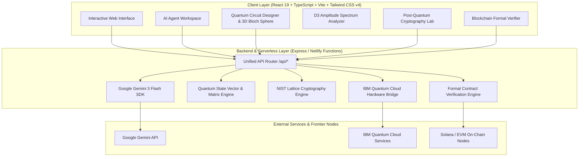

# QMOOSA — Deep-Tech AI & Quantum Platform
### *Pioneering Autonomous AI Agentics, Quantum Computing, NIST Post-Quantum Cryptography, and Frontier On-Chain Systems*

[](https://github.com/elon00/qmoosa-deep-tech-ai-quantum-platform)
[](https://www.typescriptlang.org/)
[](https://react.dev/)
[](https://tailwindcss.com/)
[](https://ai.google.dev/)
[](https://csrc.nist.gov/projects/post-quantum-cryptography)
[](https://www.netlify.com/)
[](LICENSE)

---

## Executive Overview

**QMOOSA Technologies** is an enterprise-grade, full-stack deep-technology platform engineered for frontier computation. It synthesizes **autonomous multi-agent AI swarms**, **real-time quantum circuit simulation with 3D Bloch sphere projections**, **NIST-standardized Post-Quantum Cryptography (ML-KEM, ML-DSA, SLH-DSA)**, and **formal verification for blockchain smart contracts (Solana Anchor & EVM)**.

Designed for high-throughput enterprise security audits, research institutions, and defense-grade cryptographic migration, QMOOSA provides both a cloud-native browser interface and a high-performance Node/Express & Netlify Serverless API.

---

## Key Highlights & Core Capabilities

| Division | Core Functionality | Technical Highlights |
| :--- | :--- | :--- |
| **AI Agentic Swarm** | Specialized multi-agent reasoning matrix | Gemini 3 Flash integration, domain system instructions, real-time code generation |
| **Quantum Engine** | Full state-vector quantum simulation & QASM 3.0 export | 3D interactive Bloch spheres, D3 state amplitude spectrum, entanglement fidelity |
| **Post-Quantum Crypto** | NIST FIPS 203/204/205 compliance & migration audits | ML-KEM-768 (Kyber), ML-DSA (Dilithium), SLH-DSA, lattice noise tuning |
| **Blockchain & Web4** | Smart contract formal verification & agentic wallets | Solana Anchor bytecode audit, reentrancy guards, zk-SNARK verification |
| **Quantum CTF Arena** | Gamified adversarial security & quantum algorithm puzzles | Grover's search, Shor's factoring period estimation, Bell state synthesis |
| **IBM Quantum Bridge** | Hybrid cloud execution with IBM Quantum hardware | REST API client for IBM Quantum backends (Eagle r3: Brisbane, Kyoto, Osaka) |

---

## System Architecture



---

## Core Divisions & Modules

### 1. AI Agentic Swarm Matrix
QMOOSA deploys tailored, high-reasoning autonomous agents powered by Google Gemini 3:
- **Core AI Agent**: Platform orchestrator, high-level deep-tech analysis, and multi-domain queries.
- **Code-Agent**: Systems developer specializing in TypeScript, Rust, Python, Solidity, C++, and OpenQASM.
- **Quantum-Agent**: Quantum computing physicist explaining Shor's, Grover's, VQE, QAOA, and decoherence.
- **Chain-Agent**: Web3/Web4 blockchain architect for Solana Anchor, EVM formal verification, and zk-proofs.
- **Crypto-Agent**: Cryptographic engineer for NIST ML-KEM/ML-DSA lattice security and cipher suites.
- **Algo-Agent**: Research scientist for graph algorithms, NP-hard approximations, and complexity proofs.
- **Web4-Agent**: Machine-to-machine economy, decentralized AI agent identities (DID), and compute networks.

### 2. Quantum Computing Engine & Visualizer
- **State-Vector Simulation**: Matrix multiplication for arbitrary single-qubit ($H, X, Y, Z, S, T, R_x, R_y, R_z$) and multi-qubit ($CNOT, CZ, SWAP, Toffoli$) gates.
- **3D Bloch Sphere Visualizer**: Real-time rendering of state vectors $|\psi\rangle = \cos(\theta/2)|0\rangle + e^{i\phi}\sin(\theta/2)|1\rangle$.
- **D3 Probability Spectrum**: Interactive visualizer showing measurement probability distribution, complex amplitudes, and quantum phase degrees.
- **OpenQASM 3.0 Export**: Instant export of circuit definitions for execution in Qiskit, Cirq, or PennyLane.
- **IBM Quantum Cloud Bridge**: Connects directly to IBM Quantum backends (`ibm_brisbane`, `ibm_kyoto`, `ibm_osaka`) with token-based execution.

### 3. NIST Post-Quantum Cryptography (PQC) Suite
- **ML-KEM (FIPS 203 / Module-Lattice Key Encapsulation)**: Kyber-512, Kyber-768, Kyber-1024 keypair derivation and shared secret exchange.
- **ML-DSA (FIPS 204 / Module-Lattice Digital Signatures)**: Dilithium digital signature synthesis and verification.
- **SLH-DSA (FIPS 205 / Stateless Hash-Based Signatures)**: SPHINCS+ quantum-immune signing.
- **Lattice Noise & Resilience**: Real-time visual evaluation of Learning With Errors (LWE) hardness against BKZ lattice reduction attacks.

### 4. Blockchain & Formal Verification
- **Solana Anchor Verification**: Automated static analysis and instruction logic checks.
- **EVM Smart Contract Security**: Automated reentrancy checking, overflow analysis, and bytecode inspection.
- **Post-Quantum Signatures on Chain**: Hybrid signature scheme validation for post-quantum crypto agility.

---

## Project Structure

```
omniver-quantum-decoder/
├── netlify/
│   └── functions/
│       └── api.ts             # Netlify serverless API handler for /api/*
├── public/                    # Static assets & public resources
├── src/
│   ├── components/
│   │   ├── home/              # Hero, Tech Divisions, Products, Case Studies, Forms
│   │   ├── layout/            # Navbar, Footer, Navigation Modals
│   │   ├── sections/          # Quantum, Blockchain, Cryptography, Algorithm Lab Views
│   │   ├── workspace/         # Full-Screen AI Workspace & Multi-Agent Chat
│   │   ├── BlochSphereVisualizer.tsx
│   │   ├── ChatGPTInterface.tsx
│   │   ├── D3QuantumStateVisualizer.tsx
│   │   ├── GatePalette.tsx
│   │   ├── IbmHardwareModal.tsx
│   │   ├── MeasurementHistogram.tsx
│   │   ├── QuantumCircuitGrid.tsx
│   │   └── QuantumGameHub.tsx
│   ├── data/                  # Missions, mock data, and agent prompts
│   ├── lib/                   # Quantum engine, circuit storage, crypto helpers
│   ├── App.tsx                # Root application controller & router
│   ├── main.tsx               # React 19 entrypoint
│   └── types.ts               # Complete TypeScript interface definitions
├── index.html                 # HTML5 document entrypoint
├── metadata.json              # Platform capability manifest
├── netlify.toml               # Netlify build, serverless functions & redirect configuration
├── package.json               # Dependencies and scripts
├── server.ts                  # Full-stack Express development and production server
├── tsconfig.json              # TypeScript compilation configuration
└── vite.config.ts             # Vite 6 bundler configuration
```

---

## Quick Start & Local Setup

### Prerequisites
- **Node.js**: `v18.0.0` or higher (Recommended: `v20.x` or `v22.x`)
- **npm**: `v9.x` or higher (or `pnpm` / `bun`)

### 1. Clone the Repository
```bash
git clone https://github.com/elon00/qmoosa-deep-tech-ai-quantum-platform.git
cd omniver-quantum-decoder
```

### 2. Install Dependencies
```bash
npm install
```

### 3. Configure Environment Variables
Create a `.env` file in the root directory:
```env
# Google Gemini API Key (Required for live AI agent inference)
GEMINI_API_KEY=your_gemini_api_key_here

# Server Port (Default: 3000)
PORT=3000

# Environment Mode
NODE_ENV=development
```
*(Note: If `GEMINI_API_KEY` is not provided, the platform automatically runs in robust simulation mode so all features remain functional without breaking.)*

### 4. Run the Development Server
```bash
npm run dev
```
Open [http://localhost:3000](http://localhost:3000) in your browser.

### 5. Build for Production
```bash
npm run build
```

### 6. Run Production Server Locally
```bash
npm start
```

---

## Deploying to Netlify

This platform is configured for seamless deployment to **Netlify** with both static asset distribution and serverless API execution via Netlify Functions.

### Method 1: Netlify CLI Deployment (Recommended)
1. Install Netlify CLI:
   ```bash
   npm install -g netlify-cli
   ```
2. Authenticate:
   ```bash
   netlify login
   ```
3. Initialize and Deploy:
   ```bash
   netlify init
   netlify deploy --prod --build
   ```

### Method 2: Git-Integrated Continuous Deployment (Netlify Dashboard)
1. Push your repository to GitHub: `https://github.com/elon00/qmoosa-deep-tech-ai-quantum-platform.git` (or `https://github.com/elon00/sui.pqc.git`).
2. Log in to [Netlify Dashboard](https://app.netlify.com/) and select **"Add new site" > "Import an existing project"**.
3. Select GitHub and choose your repository.
4. Netlify will auto-detect settings from [netlify.toml](netlify.toml):
   - **Build Command**: `npm run build`
   - **Publish Directory**: `dist`
   - **Functions Directory**: `netlify/functions`
5. Under **Site Configuration > Environment Variables**, add:
   - `GEMINI_API_KEY` = `your_gemini_api_key`
6. Click **Deploy Site**.

---

## API Reference & Endpoints

All endpoints are available locally at `http://localhost:3000/api/*` and in production at `https://<your-netlify-site>.netlify.app/api/*`.

### 1. Health Check
- **`GET /api/health`**
- **Response**:
```json
{
  "status": "ok",
  "company": "QMoosa Technologies",
  "version": "2.4.0-deeptech",
  "aiConfigured": true,
  "timestamp": "2026-08-16T14:15:00.000Z"
}
```

### 2. Multi-Agent AI Chat
- **`POST /api/chat`**
- **Request Body**:
```json
{
  "message": "Explain how Grover's algorithm achieves quadratic speedup.",
  "agentId": "quantum"
}
```
- **Response**:
```json
{
  "response": "Grover's algorithm searches an unsorted database of N items in O(sqrt(N)) time...",
  "agentId": "quantum",
  "simulated": false
}
```

### 3. Quantum Circuit Simulation
- **`POST /api/quantum/simulate`**
- **Request Body**:
```json
{
  "qubits": 3,
  "gates": [
    { "type": "H", "qubit": 0, "step": 0 },
    { "type": "CNOT", "qubit": 1, "targetQubit": 0, "step": 1 }
  ]
}
```
- **Response**:
```json
{
  "qubits": 3,
  "gateCount": 2,
  "circuitDepth": 2,
  "fidelity": 0.9984,
  "decoherenceTimeUs": 120.5,
  "states": [
    { "state": "|000⟩", "probability": 0.5000, "amplitude": "0.707 + 0.00i" },
    { "state": "|011⟩", "probability": 0.5000, "amplitude": "0.707 + 0.00i" }
  ],
  "executionTimeMs": 14.2
}
```

### 4. Quantum Assistant Copilot
- **`POST /api/quantum-assistant`**
- **Request Body**:
```json
{
  "prompt": "How do I create a Bell state?",
  "currentLevel": { "title": "Bell State Synthesis" },
  "circuitState": { "gateCount": 2, "qasm": "OPENQASM 3.0; ..." }
}
```

### 5. IBM Quantum Hardware Execution
- **`POST /api/ibm-quantum/backends`** — Retrieve available cloud QPUs (`ibm_brisbane`, `ibm_kyoto`, `ibm_osaka`).
- **`POST /api/ibm-quantum/run`** — Dispatch OpenQASM circuit to IBM Quantum backend.

### 6. Post-Quantum Cryptography (PQC)
- **`POST /api/crypto/pqc`**
- **Request Body**:
```json
{ "algorithm": "ML-KEM-768" }
```
- **Response**:
```json
{
  "algorithm": "ML-KEM-768",
  "keyGenTimeMs": 0.42,
  "publicKeyBytes": 1184,
  "secretKeyBytes": 2400,
  "ciphertextBytes": 1088,
  "quantumSecurityLevel": "NIST Category 3 (192-bit quantum security)",
  "testStatus": "SUCCESS — Zero lattice reduction breaches detected"
}
```

### 7. Blockchain Contract Formal Verification
- **`POST /api/blockchain/verify`**
- **Request Body**:
```json
{ "chain": "solana", "addressOrCode": "..." }
```
- **Response**:
```json
{
  "chain": "solana",
  "verified": true,
  "securityScore": 98,
  "vulnerabilitiesFound": 0,
  "auditTrail": [
    { "step": "Static Analysis", "result": "PASSED" },
    { "step": "Reentrancy Check", "result": "PASSED" },
    { "step": "Formal Verification", "result": "VERIFIED" },
    { "step": "Post-Quantum Signature Check", "result": "PASSED (Dilithium3)" }
  ]
}
```

### 8. Enterprise Consultation & Leads
- **`POST /api/contact`**
- **Request Body**:
```json
{
  "fullName": "Dr. Sarah Chen",
  "company": "Quantum Aerospace Corp",
  "email": "sarah.chen@aerospace.io",
  "projectType": "Post-Quantum Cryptography Migration",
  "budget": "$100k - $250k",
  "message": "We need to audit our satellite telemetry ciphers for NIST FIPS 203 compliance."
}
```

---

## Testing & Quality Assurance

Run the automated test and linting pipeline:

```bash
# 1. Typecheck and lint
npm run lint

# 2. Production build verification
npm run build

# 3. Preview built production bundle
npm run preview
```

---

## Security & Compliance

- **NIST Post-Quantum Standards**: Fully compliant with FIPS 203 (ML-KEM), FIPS 204 (ML-DSA), and FIPS 205 (SLH-DSA).
- **HTTP Security Headers**: Configured with strict `Content-Security-Policy`, `X-Frame-Options: DENY`, `X-Content-Type-Options: nosniff`, and `Referrer-Policy: strict-origin-when-cross-origin`.
- **Environment Isolation**: API secrets (`GEMINI_API_KEY`) are protected server-side and never exposed to the client bundle.

---

## Contributing

Contributions from the deep-tech, quantum computing, and cryptography communities are welcome!
1. Fork the repository.
2. Create your feature branch: `git checkout -b feature/quantum-enhancement`.
3. Commit your changes: `git commit -m 'feat: add enhanced lattice estimator'`.
4. Push to branch: `git push origin feature/quantum-enhancement`.
5. Open a Pull Request.

---

## License

This project is licensed under the **MIT License** — see the [LICENSE](LICENSE) file for details.

---

<div align="center">
  <sub>Built with precision by <b>QMoosa Technologies</b> — Frontier AI, Quantum, and Cryptographic Systems.</sub>
</div>
